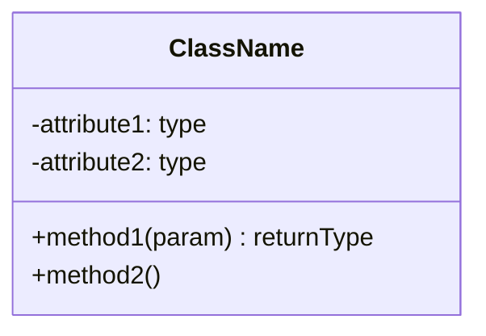
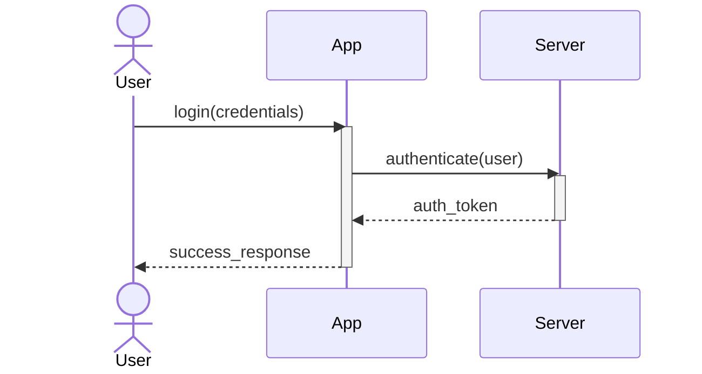
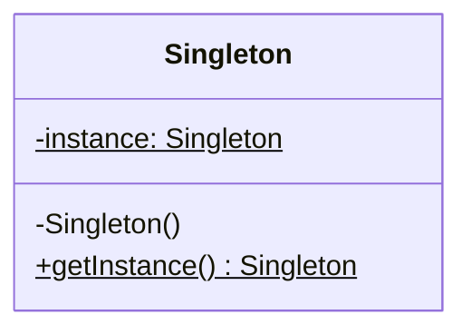
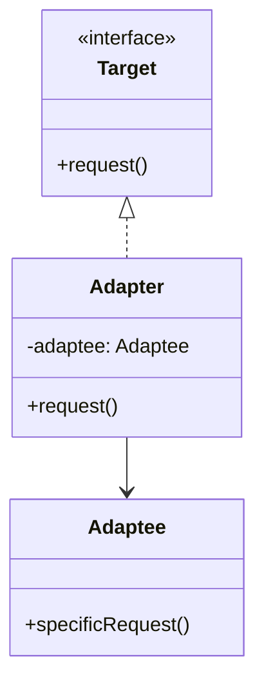
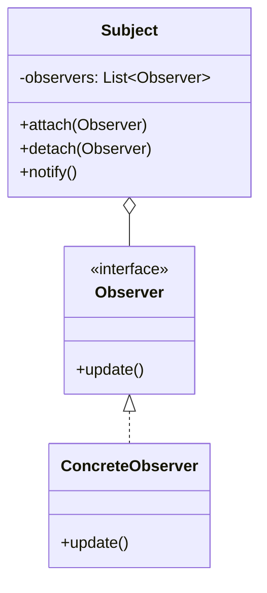

## **2. Understanding Design Patterns**

### **What are Design Patterns?**
Design patterns are typical solutions to common problems in software design. They are like blueprints that you can customize to solve a recurring design problem in your code. They are not snippets of code, but general concepts for solving problems.

### **Design Patterns using UML Diagrams**
Unified Modeling Language (UML) is a standardized way to visualize the design of a system.
- **Class Diagrams**: Show the classes in a system, their attributes, methods, and the relationships between them (Inheritance, Association, Composition).

#### **Anatomy of a Class Diagram**

In UML, a class is represented by a rectangle divided into three horizontal compartments:

> **Note**: While many Markdown viewers support Mermaid diagrams, here is the structural breakdown:

1.  **Top Section (Class Name)**: The name of the class, centered and bolded. If the name is *italicized*, it represents an **Abstract Class**.
2.  **Middle Section (Attributes/Fields)**: Lists the class's variables. 
    - Format: `visibility name : type`
3.  **Bottom Section (Methods/Operations)**: Lists the class's functions.
    - Format: `visibility name(parameters) : returnType`

#### **Visibility Symbols**

| Symbol | Visibility | Description |
| :---: | :--- | :--- |
| **`+`** | **Public** | Accessible from any other class. |
| **`-`** | **Private** | Accessible only within the class itself. |
| **`#`** | **Protected** | Accessible within the class and its subclasses. |
| **`~`** | **Package** | Accessible by any class in the same package (less common in Python). |

#### **Class Relationships**

To fully understand a class diagram, you must recognize how classes connect:

- **Inheritance (Is-a)**: A solid line with a hollow arrow pointing to the parent.
- **Association (Has-a)**: A solid line between two classes, representing a structural relationship.
- **Aggregation (Part-of)**: A hollow diamond on the "whole" side; implies the part can exist independently.
- **Composition (Strong Part-of)**: A filled diamond on the "whole" side; implies the part cannot exist without the whole.

#### **Anatomy of a Sequence Diagram**

While a Class Diagram shows the **static** structure, a Sequence Diagram shows the **dynamic** behavior—how objects interact over time.

#### **Key Components**

- **Lifelines (Vertical Lines)**: Represent the existence of an object or actor over time.
- **Messages (Arrows)**:
    - `->>` (Solid Arrow): Synchronous call (waits for response).
    - `-->>` (Dashed Arrow): Return message.
    - `->` (Thin Arrow): Asynchronous message.
- **Activation Bars (Rectangles on Lifelines)**: Indicate when an object is "active" or performing a task.
- **Actors (Stick Figures)**: Represent external entities (users or other systems) interacting with your system.

#### **Control Logic (Fragments)**

Sequence diagrams can also show logic using "Fragments":
- **Alt (Alternative)**: Equivalent to `if/else`.
- **Opt (Optional)**: Equivalent to `if`.
- **Loop**: Equivalent to `for` or `while`.

### **Importance of Design Patterns**

- **Standardization**: Provides a common language for developers, making it easier to communicate complex architectural ideas.
- **Proven Solutions**: Uses tested approaches to solve recurring design issues, reducing the risk of architectural failure.
- **Maintainability**: Makes code more readable and modular, allowing for easier debugging and updates.
- **Scalability**: Helps in building robust systems that can handle growth and complexity without becoming "spaghetti code."

---

## **3. Classes of Design Patterns**

Design patterns are generally categorized into three main groups:

### **1. Creational Patterns**
These patterns deal with object creation mechanisms, trying to create objects in a manner suitable to the situation.

#### **Visual Concept: Singleton Pattern**
The Singleton pattern ensures that a class has only one instance and provides a global point of access to it.

- **Examples**:
    - **Singleton**: Ensures a class has only one instance.
    - **Factory Method**: Provides an interface for creating objects but allows subclasses to alter the type of objects that will be created.
    - **Builder**: Separates the construction of a complex object from its representation.

### **2. Structural Patterns**
These patterns explain how to assemble objects and classes into larger structures while keeping these structures flexible and efficient.

#### **Visual Concept: Adapter Pattern**
The Adapter pattern allows objects with incompatible interfaces to collaborate by "adapting" one interface to another.

- **Examples**:
    - **Adapter**: Allows objects with incompatible interfaces to collaborate.
    - **Decorator**: Attaches new behaviors to objects by placing these objects inside special wrapper objects.
    - **Facade**: Provides a simplified interface to a library, a framework, or any other complex set of classes.

### **3. Behavioral Patterns**
These patterns are concerned with algorithms and the assignment of responsibilities between objects.

#### **Visual Concept: Observer Pattern**
The Observer pattern defines a subscription mechanism to notify multiple objects about any events that happen to the object they’re observing.

- **Examples**:
    - **Observer**: Defines a subscription mechanism to notify multiple objects about any events that happen to the object they’re observing.
    - **Strategy**: Defines a family of algorithms, puts each of them into a separate class, and makes their objects interchangeable.
    - **Command**: Turns a request into a stand-alone object that contains all information about the request.
<<<<<<< HEAD

    test
thus is a test
=======
>>>>>>> parent of 7b65c21 (added the main diles)
